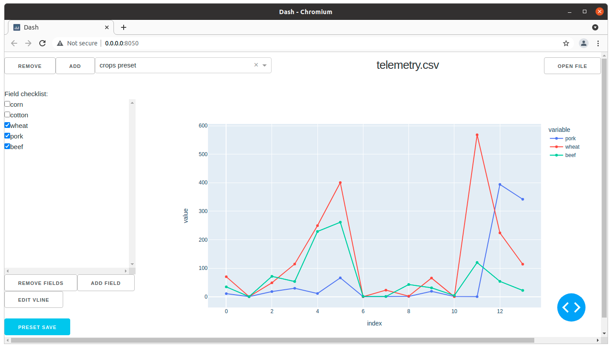

# dashly
csv visual plotter using python dash, inspired by px4/flightplot java utility

## install(without docker)
* python3.8 (other version probably work too)
* pip3 install dash pandas dash-bootstrap-components
* run: python3 app.py
* open browser: http://127.0.0.1:8050

## install(with docker)
```
#cd <repo directory>

#needed once to build image from Dockerfile
docker build ./ -t dash-images.3.10

#run 
./run.sh

#or run
docker run --rm -p 8050:8050 -v $PWD:/code --name dashly-server dash-images.3.10 python app.py

#gui frontend
firefox 127.0.0.1:8050
```

